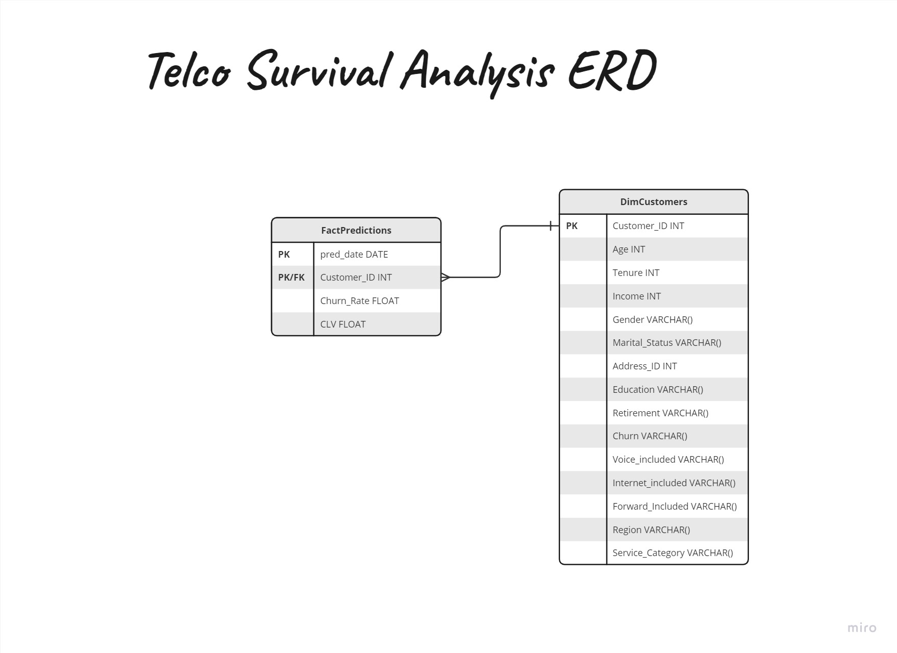

# MA-SurvivalAnalysis-Project

Unlock survival analysis, churn prediction, and CLV estimation with our Python package. Tailor your insights and drive data-driven decisions.

## Getting Started

Follow these simple steps to get started with our package:

### Step 1: Database Preparation

1. Run `schema_builder.py` to create the necessary database. An Entity Relationship Diagram (ERD) of the database can be found in the `survival_analysis/database_preparation/ERD.jpg` file.

### Step 2: Adding Data

2. Run `sql_interaction.py` to populate the database with your data. Ensure that the column names in your CSV file match the column names in the database.

### Step 3: Adding Data

3. Run `model.py` to predict CLV and Churn Rate for the customers and populate the database with the results. Ensure that the column names in your CSV file match the column names in the database.