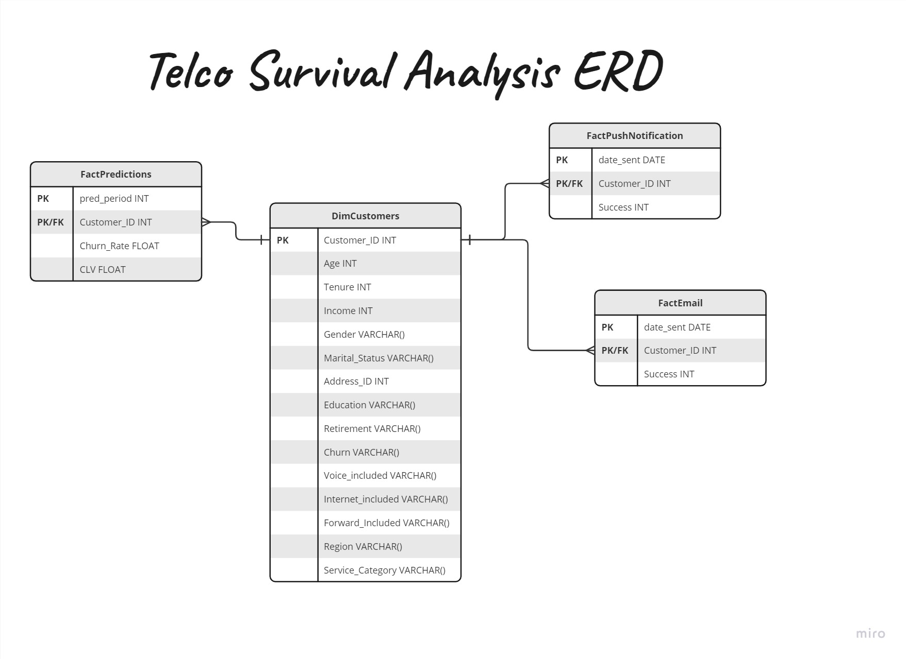

# Survival Analysis Package

## Overview

The **Survival Analysis** package is a Python toolkit for analyzing and predicting customer churn and lifetime value using survival analysis techniques. This package encompasses several modules that cover database schema creation, SQL interactions, predictive modeling, and utility functions for data preprocessing.

## Installation 

```python
pip install survival_analysis
```
## Documentation

Detailed information about our package can be found at 
https://anna-shaljyan.github.io/mkdocs-survival-analysis/?fbclid=IwAR2Kxzv_bs3WhMpGeU9jP0lKwvQ-sGPK_EG4ualMhqPFglEX9Nhoo8bE8N0

## Modules

### 1. `schema.py`

#### Module Description:

This module, `schema.py`, contains Python code for defining and creating a database schema using SQLAlchemy. It defines tables 'DimCustomer', 'FactPredictions', 'FactPushNotification', and 'FactEmail' for storing customer information, predictive data, push notification details, and email information, respectively.

```python
from survival_analysis import schema
```
The final database has the below structure:



### 2. sql_interactions.py

#### Module Description:

The sql_interactions module provides a Python class named SqlHandler for interacting with SQLite databases. This class allows various operations such as connecting, inserting data, retrieving data, truncating tables, dropping tables, updating tables, and more.

```python
from survival_analysis import sql_interactions
```


Certainly! Here is the content up until the "License" section in Markdown format:

markdown
Copy code
# Survival Analysis Package

## Overview

The **Survival Analysis** package is a Python toolkit for analyzing and predicting customer churn using survival analysis techniques. This package encompasses several modules that cover database schema creation, SQL interactions, predictive modeling, and utility functions for data preprocessing.

## Modules

### 1. `schema.py`

#### Module Description:

This module, `schema.py`, contains Python code for defining and creating a database schema using SQLAlchemy. It defines tables such as 'DimCustomer', 'FactPredictions', 'FactPushNotification', and 'FactEmail' for storing customer information, predictive data, push notification details, and email information, respectively.

```python
from survival_analysis import schema
```

### 2. sql_interactions.py

#### Module Description:

The sql_interactions module provides a Python class named SqlHandler for interacting with SQLite databases. This class allows various operations such as connecting, inserting data, retrieving data, truncating tables, dropping tables, updating tables, and more.

```python
from survival_analysis import sql_interactions
```

### 3. model_AFT.py

#### Module Description:

The model_AFT module implements an Accelerated Failure Time (AFT) model for predicting customer churn and lifetime value. It includes classes for different AFT models, a model selector for choosing the best model based on AIC, and methods for fitting the model and generating predictions.

```python
from survival_analysis import model_AFT
```

### 4. utils.py

#### Module Description:

The utils module contains utility functions, including format_dataframe, which converts categorical variables to binary columns using one-hot encoding and ensures correct data types for numeric variables.

```python
from survival_analysis import utils
```
## Example Usage
An example demonstrating the use of this package can be found at https://github.com/ella-2002e/MA-SurvivalAnalysis-Project/blob/main/Example.ipynb


## License
This package is provided under the MIT License. Feel free to use and modify it in your projects.