# API

### How to activate api.py

Run `run.py` to see initially a message in port, add /docs to see put methods and two get endpoints besides message.
Port should look something like this: http://127.0.0.1:8000/docs#/ . You can run `run.py` by executing python run.py in your terminal in venv. 

``` bash
python run.py
```

```py title="run.py"
#Importing libraries
import uvicorn
import os
import fastapi

from survival_analysis.api import app

if __name__== "__main__":
    uvicorn.run(app)
```

### Code
``` py title="api.py"
from fastapi import FastAPI, HTTPException, Query, File, UploadFile, Path
from fastapi.responses import JSONResponse
from fastapi.encoders import jsonable_encoder
from datetime import datetime
import sqlite3
import logging
from ..logger import CustomFormatter
from ..database_preparation import SqlHandler
import os
import pandas as pd
from typing import Any, List, Union, Optional
import traceback

app = FastAPI()
    
logger = logging.getLogger(os.path.basename(__file__))
logger.setLevel(logging.DEBUG)
ch = logging.StreamHandler()
ch.setLevel(logging.DEBUG)
ch.setFormatter(CustomFormatter())
logger.addHandler(ch)

# Creating instances of SqlHandler for each table
dim_customer_handler = SqlHandler(dbname='sa_db', table_name='DimCustomer')
fact_predictions_handler = SqlHandler(dbname='sa_db', table_name='FactPredictions')
fact_push_notification_handler = SqlHandler(dbname='sa_db', table_name='FactPushNotification')
fact_email_handler = SqlHandler(dbname='sa_db', table_name='FactEmail')

# Defining functions to open connections to the databases
def get_dim_customer_db():
    return dim_customer_handler.cnxn

def get_fact_predictions_db():
    return fact_predictions_handler.cnxn

def get_fact_push_notification_db():
    return fact_push_notification_handler.cnxn

def get_fact_email_db():
    return fact_email_handler.cnxn

@app.on_event("shutdown")
async def shutdown_event():
    # Closing the database connections on shutdown
    dim_customer_handler.close_cnxn()
    fact_predictions_handler.close_cnxn()
    fact_push_notification_handler.close_cnxn()
    fact_email_handler.close_cnxn()

@app.get("/")
async def root():
    return {
        """
            Initializing API for Survival Analysis project with selecting data from database, inserting data, and updating data. It now contains also several endpoints that help to identify top customers with the highest churn rate, customers with the highest/lowest CLV. Add /docs to see available endpoints.
        """
    }

def read_csv(file: UploadFile = File(...)):
    content = pd.read_csv(file.file)
    return content

def validate_sent_date(sent_date):
    try:
        # Trying to parse the send_date as a datetime object
        datetime.strptime(sent_date, '%d/%m/%Y')
        return True
    except ValueError:
        return False

@app.put("/populate_fact_push_notification")
async def populate_fact_push_notification(file: UploadFile = File(...)):
    try:
        # Reading the CSV file
        data = read_csv(file)
        
        # Validating sent_date column
        if 'sent_date' in data.columns and not all(data['sent_date'].apply(validate_sent_date)):
            raise HTTPException(status_code=400, detail="Invalid or missing values in the sent_date column.")
        
        # Inserting data into FactPushNotification table
        fact_push_notification_handler.insert_many(data)

        return JSONResponse(content=jsonable_encoder({"message": "Data loaded successfully"}), status_code=200)

    except Exception as e:
        logger.error(f"Failed to populate FactPushNotification: {str(e)}")
        raise HTTPException(status_code=500, detail=f"Failed to populate FactPushNotification: {str(e)}")
    
@app.put("/populate_fact_email")
async def populate_fact_email(file: UploadFile = File(...)):
    try:
        # Reading the CSV file
        data = read_csv(file)
        
        # Validating sent_date column
        if 'sent_date' in data.columns and not all(data['sent_date'].apply(validate_sent_date)):
            raise HTTPException(status_code=400, detail="Invalid or missing values in the sent_date column.")
        
        # Inserting data into FactEmail table
        fact_email_handler.insert_many(data)

        return JSONResponse(content=jsonable_encoder({"message": "Data loaded successfully"}), status_code=200)

    except Exception as e:
        logger.error(f"Failed to populate FactEmail: {str(e)}")
        logger.error(traceback.format_exc())
        raise HTTPException(status_code=500, detail=f"Failed to populate FactEmail: {str(e)}")

    
## Adding endpoints for different scenarios

@app.get("/get_top_churn_clv_customers")
async def get_top_churn_clv_customers(
    pred_period: int = Query(..., description="Prediction period (1-12)"),
    top_percentage: int = Query(10, description="Top percentage of customers to select (e.g., 10 for top 10%)", ge=1, le=100)
):
    try:
        handler = fact_predictions_handler

        # Calling the from_sql_to_pandas function to get the data for FactPredictions
        fact_data = handler.from_sql_to_pandas(chunksize=1000, id_value='customer_ID')

        # Filtering the data for the specified prediction period
        selected_data = fact_data[fact_data['pred_period'] == pred_period]

        # Sorting the data first by Churn_Rate and then by CLV in descending order
        sorted_data = selected_data.sort_values(by=['Churn_Rate', 'CLV'], ascending=[False, False])

        # Calculating the number of customers to select based on the specified top percentage
        total_customers = len(sorted_data)
        top_count = int(top_percentage / 100 * total_customers)

        # Selecting the top percentage of customers with the highest churn rate and then CLV
        top_churn_customers = sorted_data.head(top_count)

        if top_churn_customers.empty:
            return {"message": "No customers found"}

        # Returning pred_period, customer_id, churn_rate, and clv without merging
        result_data = top_churn_customers[['pred_period', 'customer_ID', 'Churn_Rate', 'CLV']].to_dict(orient='records')

        return result_data
    except Exception as e:
        logger.error(f"Failed to get top churn customers: {str(e)}")
        raise HTTPException(status_code=500, detail=f"Failed to get top churn customers: {str(e)}")


@app.get("/get_top_clv_customers")
async def get_top_clv_customers(
    top_percentage: int = Query(..., description="Percentage of customers to select (e.g., 20 for top 20%)", ge=1, le=100),
    pred_period: int = Query(12, description="Prediction period (1-12)")
):
    try:
        handler = fact_predictions_handler

        # Calling the from_sql_to_pandas function to get the data for FactPredictions
        fact_data = handler.from_sql_to_pandas(chunksize=1000, id_value='customer_ID')

        # Filtering the data for the specified prediction period
        selected_data = fact_data[fact_data['pred_period'] == pred_period]

        # Sorting the data by CLV in descending order
        sorted_data = selected_data.sort_values(by='CLV', ascending=False)

        # Calculating the number of customers to select based on the specified top percentage
        total_customers = len(sorted_data)
        selected_count = int(top_percentage / 100 * total_customers)

        # Selecting the top percentage of customers
        selected_customers = sorted_data.head(selected_count)

        if selected_customers.empty:
            return {"message": "No customers found"}

        # Returning only customer_id and pred_period without merging
        result_data = selected_customers[['customer_ID', 'pred_period']].to_dict(orient='records')

        return {"selected_customers": result_data}
    except Exception as e:
        logger.error(f"Failed to get top CLV customers: {str(e)}")
        raise HTTPException(status_code=500, detail=f"Failed to get top CLV customers: {str(e)}")
```

### API Overview


### Use cases

#### The API contains:

#### 1. Two get methods: get_top_churn_clv_customers & get_top_clv_customers 
- First endpoint /get_top_churn_clv_customers accepts pred_period and number of percentage for sorting customers initially by churn_rate and then by clv. It returns top x% customers based on churn_rate & CLV.

#### Sample test: 
- pred_period = 5 
- top_percentage = 20

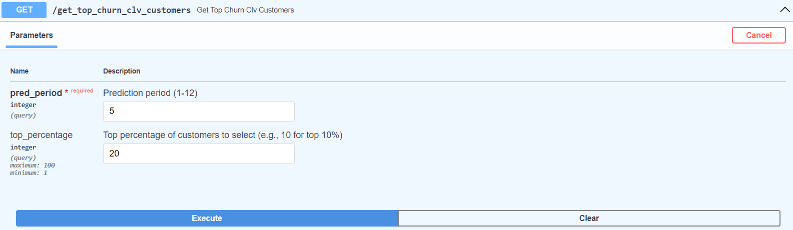

#### Result /get_top_churn_clv_customers

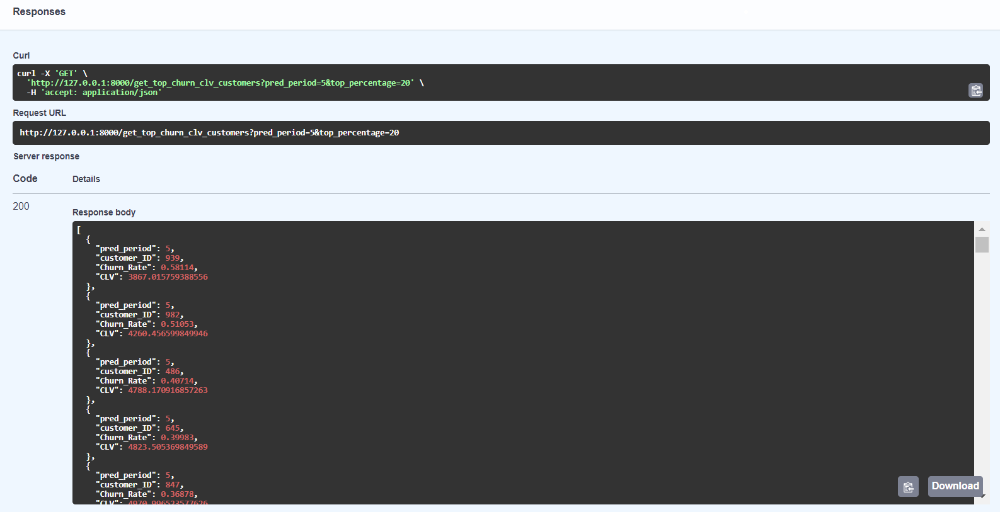

- Second endpoint /get_top_clv_customers accepts pred_period and number of percentage for sorting customers by CLV. It returns top x% customers based on CLV.

#### Sample test: 
- pred_period = 12
- top_percentage = 10

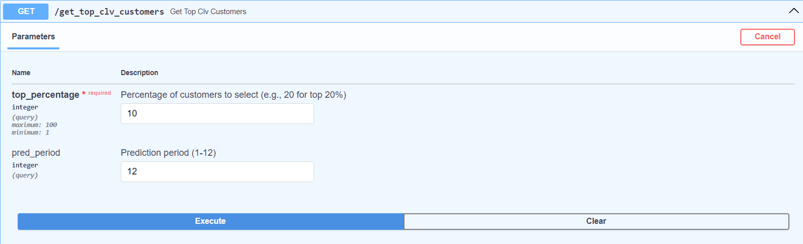

#### Result /get_top_clv_customers accepts

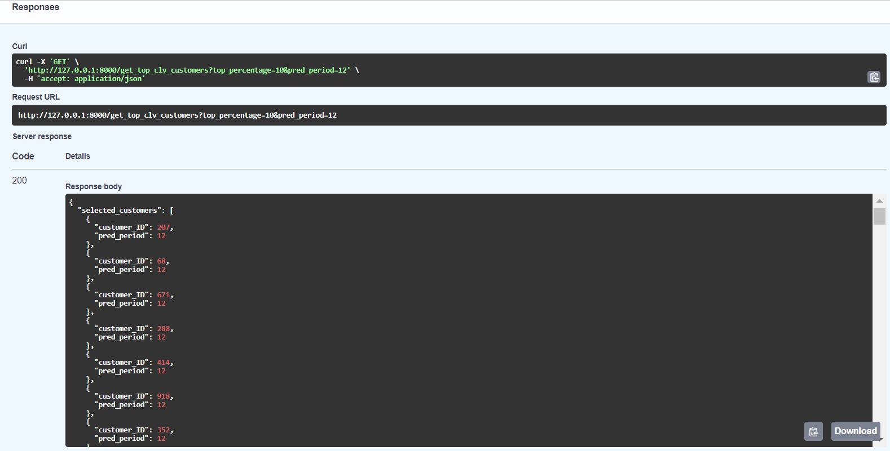

#### 2. Two put methods: populate_fact_push_notification & populate_fact_email

These two methods are created to populate the DB with the results of actions taken in response to the two get methods mentioned above.
There are two csv files email_data.csv and notifications_data.csv in Raw Data folder that contain sample generated data with structure that matches tables of the database.

- First put method allows to choose a csv file to add in FactPushNotification table. 

#### Excel file input data rows for FactPushNotification table. 

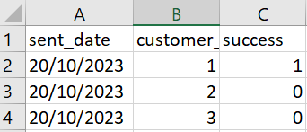

#### Sample test csv - FactPushNotification

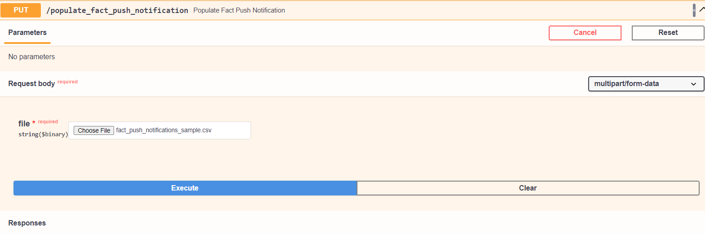

#### Sample test csv result response- FactPushNotification


#### Sample test csv added in table- FactPushNotification

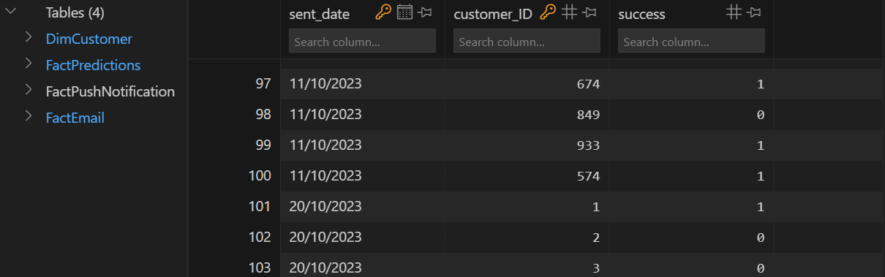

- Second put method allows to choose a csv file to add in FactEmail table. 

#### Excel file input data rows for FactEmail table. 

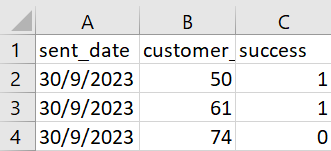

#### Sample test csv - FactEmail

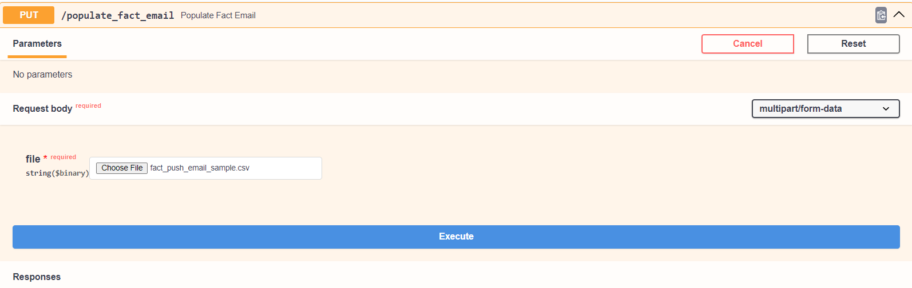

#### Sample test csv result response- FactEmail

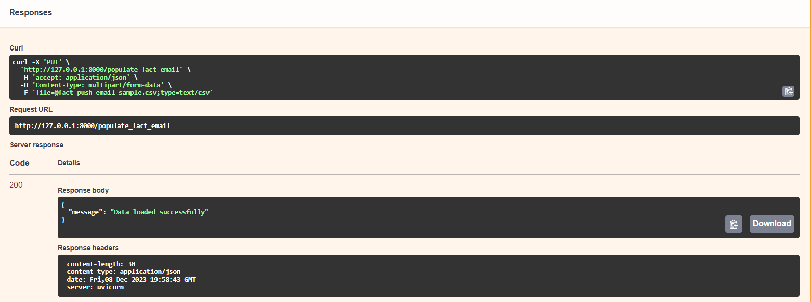

#### Sample test csv added in table- FactEmail

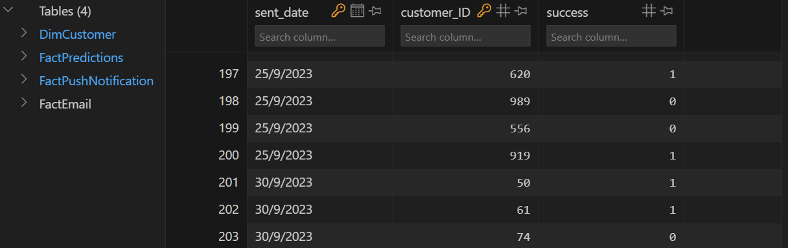


