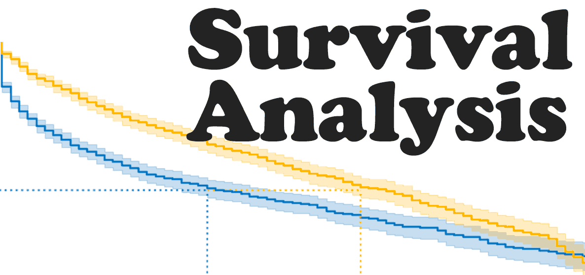

# HomePage

### Objectives and Outcomes of Survival Analysis Package:
Our easy-to-use package provides highly accurate predictions for companies. By leveraging survival analysis, churn rate prediction, and CLV estimation, this package will empower businesses to make informed, profitable, and datadriven decisions. The predictions generated will offer insights into the company's future
performance, enabling businesses to plan for the short-term and long-term with confidence.

### Problem Statement:
In the modern business landscape, companies across diverse sectors struggle with shared
challenges. These include customer churn, revenue instability, resource allocation complexities,
pricing optimization, and the imperative for personalized customer experiences. Customer churn,
signifying the loss of clientele over time, threatens the business’s continuity. Revenue volatility,
shaped by dynamic markets and shifting consumer behaviors, introduces financial uncertainties.
Personalizing customer experiences has become a fundamental requirement, necessitating a deep
understanding of individual preferences and behaviors. These are just a few examples of the
many challenges companies face in today's business world, so innovative solutions to address
these pressing issues are needed.
Understanding customer behavior, reducing churn, and maximizing the lifetime value of
customers may affect these problems in a positive way. Our project aims to build a
comprehensive model that conducts survival analysis for companies, predicts churn rates, and
estimates customer lifetime value (CLV).

### Users of the project:
The target audience for this project includes a wide range of businesses, such as subscription
services, e-commerce, finance, banking, insurance, and more, looking to analyze customer
behavior and make data-driven decisions. These businesses seek a solution to understand and
mitigate churn, improve revenue stability, allocate resources optimally, and enhance customer
personalization.

### Constraints/limitations:
Selection Bias: Our team will be aware of potential selection bias in the data and take measures to
address it.
Software Development Challenges: Our project will tackle software development challenges,
including package building and API development, to create a user-friendly and accessible solution.

### Data and Features:
The project will utilize specific data suitable for survival analysis. Feature selection and the choice
of a suitable algorithms will be key considerations in our analysis.

### Solution:
The project's solution will involve the development of an integrated package that conducts survival
analysis, predicts churn rates, and estimates CLV. This package will provide businesses with the
insights needed to understand where their company will be in the future, enabling them to make
the best and most profitable data-driven decisions. To facilitate the storage of appropriate data and
ensure easy accessibility, the project will integrate databases for data storage. Additionally, API
endpoints will be implemented to streamline usage, allowing businesses to seamlessly integrate
the package into their workflows.
The package will be designed for ease of use and will address the complex challenges related to
customer behavior and decision-making.
By addressing these challenges and providing a robust predictive solution, this project aims to
empower businesses from various sectors to proactively manage customer retention, revenue,
resource allocation, and pricing strategies while improving the overall customer experience

